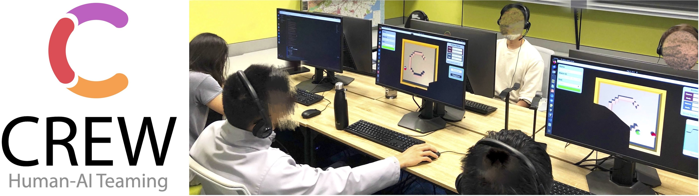

# CREW: Platform for Human-AI Teaming

[](https://generalroboticslab.github.io/crew-docs/)
[](LICENSE)

[Project Website](http://www.generalroboticslab.com/CREW) | [Video](https://www.youtube.com/watch?v=RINSo3uI0dI) | [Paper](https://arxiv.org/abs/2408.00170)

CREW is a platform designed to facilitate Human-AI teaming research, engage collaborations from multiple scientific disciplines, with a strong emphasis on human involvement. It includes pre-built tasks for cognitive studies and Human-AI teaming with expandable potentials from our modular design. Following conventional cognitive neuroscience research, CREW also supports multimodal human physiological signal recording for behavior analysis. Moreover, CREW benchmarks real-time human-guided reinforcement learning agents using state-of-the-art algorithms and well-tuned baselines.

# Authors
[Lingyu Zhang](https://lingyu98.github.io/), [Zhengran Ji](https://jzr01.github.io/), [Boyuan Chen](http://boyuanchen.com/).

Duke University, [General Robotics Lab](http://generalroboticslab.com/)

# Overview

CREW consists of two main subcomponents: Dojo and Algorithms. These subcomponents work together to create an efficient platform for developers and researchers alike.

Dojo serves as a Unity package designed specifically to facilitate the development of multiplayer games involving human and AI players. We provide a set of pre-built environments as well as a template for building custom tasks with real-time interaction enabled.

Algorithms, on the other hand, is a Python package aimed at researchers who wish to create AI agents capable of operating and collaborating with humans within the environments established by Dojo. Offering an intuitive interface, Algorithms ensures maximum flexibility and customizability for the researchers.

By working in unison, these two subcomponents create a robust and user-friendly platform for the development of interactive experiences.



# Citation
```
@inproceedings{zhang2024crew,
  title={CREW: Facilitating Human-AI Teaming Research},
  author={Zhang, Lingyu and Ji, Zhengran and Chen, Boyuan},
  booktitle={Preprint},
  year={2024}
}  
```

# Documentation

For quick examples to get started, API references, tutorials on how to run and develop algorithms and environments, please refer to our [documentation website](https://generalroboticslab.github.io/crew-docs/).

# Features

* **Extensible and open environment design.** CREW provides built-in tasks for rapid development and allows users to integrate customized tasks to accommodate the limitless applications of Human-AI teaming.

* **Real-time communication.** While some Human-AI interaction tasks, such as human preference-based fine-tuning, can be performed offline, many applications require online real-time interaction. Whether it is training decision-making models with real-time human guidance or general human-AI collaboration tasks, the ability to convey messages with minimum delay is essential. Synchronizing data flow between human interfaces, AI algorithms, and simulation engines necessitates the establishment of a real-time communication channel.

* **Hybrid Human-AI teaming support.** Teaming is an essential aspect of our daily jobs. Our vision extends this concept to Human-AI teaming, where both humans and AI operate in teams. Increasing interest in the organization, dynamics, workflow, and trust in multi-human and multi-AI teams highlights the need for a platform capable of distributing and synchronizing tasks, states, and interactions across multiple environment instances and even across physical locations.

* **Parallel sessions support.** A key bottleneck for human-involved AI research is the requirement to conduct experiments with dozens or hundreds of human subjects to obtain trustworthy and reliable conclusions. Such a process can be tedious and time-consuming. To enhance efficiency and scalability, CREW supports multiple independent parallel sessions of the same setting, unconstrained by geographical locations, to obtain the "crowd-sourcing" effects of large-scale experiments. This capability enables experimenters to collectively share experimental data and results.

* **Comprehensive human data collection.** Though human plays an important role in Human-AI teaming, our understanding of human behaviors remains limited and under-explored in existing studies. Therefore, CREW offers interfaces to simultaneously collect multi-modal human data, ranging from active instructions and feedback to passive physiological signals.

* **ML community-friendly algorithm design.** The choice of programming language and libraries should align with the customs and preferences of the ML community. The system design should be modular to allow seamless transitions between tasks and algorithms.


